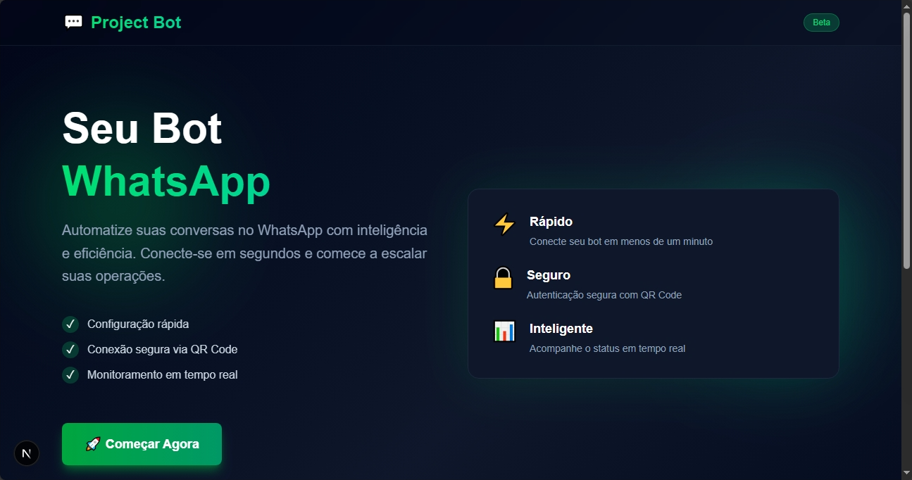

# 🤖 WhatsApp AI Agent Bot - Server Local

<div align="center">
  
  
  
  
</div>

<br>

<div align="center">
  
</div>

<br>

Bot de WhatsApp com inteligência artificial integrado ao N8N e Google Gemini para análise de dados e conversação inteligente.

## 📋 Sobre o Projeto

Este projeto é um agente de IA para WhatsApp que permite aos usuários interagir com uma IA através de mensagens. O bot utiliza:

- **Next.js** - Framework React para a interface web
- **Baileys** - Biblioteca para conexão com WhatsApp Web
- **N8N** - Plataforma de automação para orquestrar o fluxo de IA
- **Google Gemini** - Modelo de linguagem para processamento de mensagens

## 🚀 Funcionalidades

- ✅ Conexão com WhatsApp via QR Code
- ✅ Processamento de mensagens com IA
- ✅ Respostas contextualizadas e personalizadas
- ✅ Interface web para gerenciamento
- ✅ Suporte para análise de dados (futuro)

## 🛠️ Tecnologias

- Next.js 16
- TypeScript
- Baileys (WhatsApp Web API)
- Axios
- N8N
- Google Gemini AI

## 📦 Instalação

### Pré-requisitos

- Node.js 18+ instalado
- Conta no N8N (cloud ou self-hosted)
- API Key do Google Gemini

### Passo a Passo

1. Clone o repositório:
```bash
git clone https://github.com/zGabriel-Passos/n8n-AiAgent
cd project-bot
```

2. Instale as dependências:
```bash
npm install
```

3. Configure a URL do webhook N8N em `lib/whatsapp.ts`:
```typescript
const N8N_WEBHOOK_URL = "YOUR_N8N_WEBHOOK_URL";
```

4. Inicie o servidor de desenvolvimento:
```bash
npm run dev
```

5. Acesse `http://localhost:3000` e escaneie o QR Code com seu WhatsApp

## ⚙️ Configuração do N8N

### 1. Estrutura do Workflow

O fluxo segue esta sequência de 4 nós principais:

1. **Webhook (Trigger)**: Recebe a mensagem do código Node.js
2. **AI Agent (Brain)**: Processa o texto usando o System Prompt
3. **Google Gemini Chat Model**: O "motor" da IA (configurado como gemini-1.5-flash)
4. **Respond to Webhook**: Devolve a resposta formatada para o bot

### 2. Configuração dos Nós

#### Nó 1: Webhook
- **HTTP Method**: `POST`
- **Path**: `ai-agent`
- **Respond With**: `Using 'Respond to Webhook' Node` (Fundamental para a IA ter tempo de pensar)

#### Nó 2: AI Agent
- **Agent Type**: `Tools Agent`
- **Prompt Type**: `Define below`
- **Source for Prompt (User Message)**: `Define below`
- **Prompt (User Message)**: `{{ $json.body.message }}`
- **System Message**:
```
Você é o (Nome qualquer), um assistente inteligente e prestativo. Use o nome do usuário {{ $json.body.pushName }} para proximidade. Respostas curtas e diretas para WhatsApp.
```

#### Nó 3: Google Gemini Chat Model
- **Model**: `gemini-2.5-flash` (Melhor equilíbrio entre cota e velocidade)
- **API Key**: `YOUR_API_KEY_N8N`
- **Temperature**: `0.7` (Para ser amigável, mas não inventar coisas)

#### Nó 4: Respond to Webhook
- **Respond With**: `JSON`
- **Response Body** (Expressão):
```json
{{ { "output": $json.output } }}
```

### 3. Fluxo de Dados

```
WhatsApp → Next.js → N8N Webhook → AI Agent → Gemini → Response → Next.js → WhatsApp
```

O payload enviado ao N8N:
```json
{
  "sender": "5511999999999@s.whatsapp.net",
  "pushName": "Nome do Usuário",
  "message": "Texto da mensagem"
}
```

O payload retornado pelo N8N:
```json
{
  "output": "Resposta da IA aqui"
}
```

## 📁 Estrutura do Projeto

```
project-bot/
├── app/
│   ├── api/
│   │   └── whatsapp/
│   │       └── connect/
│   │           └── route.ts      # API para conectar WhatsApp
│   └── page.tsx                  # Página principal
├── lib/
│   └── whatsapp.ts               # Lógica do bot WhatsApp
├── auth_tokens/                  # Sessão do WhatsApp (não commitar)
├── next.config.ts                # Configuração do Next.js
└── package.json
```

## 🔐 Segurança

- Nunca commite a pasta `auth_tokens/` (já está no .gitignore)
- Mantenha suas API Keys em variáveis de ambiente
- Use HTTPS para o webhook do N8N

## 🐛 Troubleshooting

### Bot não conecta
- Verifique se a porta 3000 está livre
- Certifique-se de que o QR Code foi escaneado corretamente

### IA não responde
- Verifique se a URL do webhook N8N está correta
- Confirme que o workflow no N8N está ativo
- Verifique os logs do console para erros

### Erro de módulos
```bash
rm -rf node_modules package-lock.json
npm install
```

## 📝 Licença

Este projeto está sob a licença MIT.

## 👨‍💻 Autor

Desenvolvido com ❤️ para análise de dados via WhatsApp

## 🤝 Contribuindo

Contribuições são bem-vindas! Sinta-se à vontade para abrir issues e pull requests.

---

**Nota**: Este bot é para uso educacional e pessoal. Respeite os Termos de Serviço do WhatsApp.
